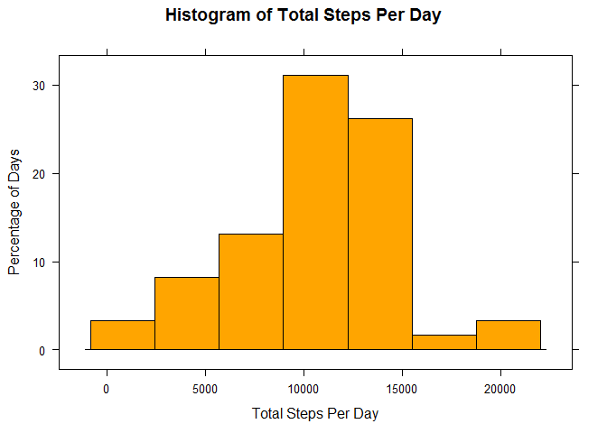
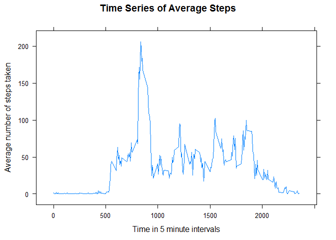
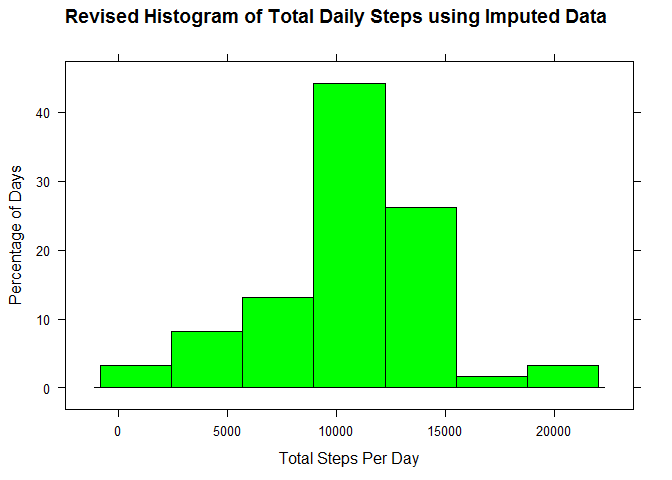
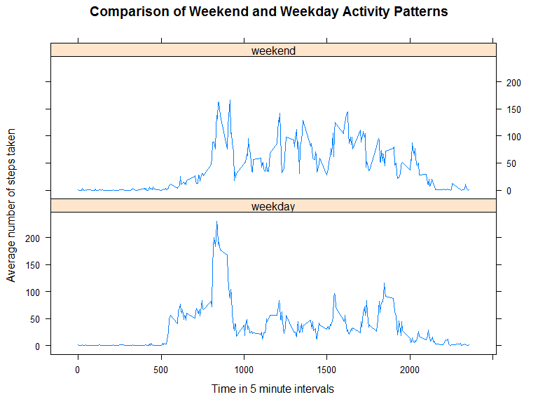

# Reproducible Research: Peer Assessment 1


## Loading and preprocessing the data

The data file is unzipped and its content is loaded into R and its date values converted from Strings into R dates.


```r
unzip("activity.zip")
activity<-tbl_df(read.csv("activity.csv", stringsAsFactors = FALSE))
activity<-mutate(activity,date=as.Date(date))
```


## What is mean total number of steps taken per day?

Missing step values (NAs) are ignored for this section of the analysis.


```r
activityByDay<-group_by(activity,date)
TotalStepsPerDay<-summarize(activityByDay,totalSteps=sum(steps))
with(TotalStepsPerDay,
     histogram(~totalSteps, col="orange", ylab = "Percentage of Days",
          xlab='Total Steps Per Day', main='Histogram of Total Steps Per Day'))
```

<!-- -->

The mean total number of steps taken per day is calculated as follows.

```r
mean(TotalStepsPerDay$totalSteps,na.rm=TRUE)
```

```
## [1] 10766.19
```

The median total number of steps taken per day is calculated as follows.

```r
median(TotalStepsPerDay$totalSteps, na.rm=TRUE)
```

```
## [1] 10765
```

## What is the average daily activity pattern?

Missing step values (NAs) are also ignored in this section of the analysis.


```r
activityByInterval<-group_by(activity,interval)
StepsPerInterval<-summarize(activityByInterval,average=mean(steps, na.rm=TRUE))
with(StepsPerInterval, xyplot(average~interval, type="l", xlab="Time in 5 minute intervals", 
                            ylab="Average number of steps taken", main="Time Series of Average Steps"))
```

<!-- -->

```r
mostActiveInterval<-StepsPerInterval$interval[which.max(StepsPerInterval$average)]
```
The most active interval (i.e. the one containing the maximum steps on average)
is 835


## Imputing missing values

There are a total of 2304 rows i.e. day/interval combinations for which there are missing values.

For simplicity, we fill in missing values with the mean for that 5 minute interval across all days for which actual values are available and replot the histogram of total steps taken per day.


```r
missingActivity<-filter(activity,is.na(steps))
actualActivity<-filter(activity,!is.na(steps))
imputedActivity<-select(mutate(inner_join(missingActivity,StepsPerInterval), 
                               steps=average), -average)
totalActivity<-bind_rows(actualActivity,imputedActivity)

totalActivityByDay<-group_by(totalActivity,date)
TotalImputedStepsPerDay<-summarize(totalActivityByDay,totalSteps=sum(steps))
with(TotalImputedStepsPerDay,
     histogram(~totalSteps, xlab='Total Steps Per Day', col="green", 
          ylab = "Percentage of Days",
          main='Revised Histogram of Total Daily Steps using Imputed Data'))
```

<!-- -->

Filling in (rather than ignoring) the missing values results in the histogram becoming more more concentrated around the center.

The mean and median total number of daily steps are recalculated as follows:


```r
mean(TotalImputedStepsPerDay$totalSteps)
```

```
## [1] 10766.19
```


```r
median(TotalImputedStepsPerDay$totalSteps)
```

```
## [1] 10766.19
```

i.e. the mean is unchanged while the median has increased slightly and become identical to the mean.

Closer examination reveals that for each day, either all interval step counts are available or all are missing from the original data set:

```r
table(activity$date[is.na(activity$steps)])
```

```
## 
## 2012-10-01 2012-10-08 2012-11-01 2012-11-04 2012-11-09 2012-11-10 
##        288        288        288        288        288        288 
## 2012-11-14 2012-11-30 
##        288        288
```


The original approach ingored missing values so these missing days were excluded completely from the original histogram. So this approach for imputing missing values implicitly introduces an average day for each missing day which of course  increases the concentration of the distribution around its mean.


## Are there differences in activity patterns between weekdays and weekends?

This section of the analysis uses the imputed data from the previous section.


```r
totalActivity$dayType<-"weekday"
totalActivity$dayType[weekdays(totalActivity$date) %in% c("Saturday", "Sunday")]<-"weekend"
totalActivity$dayType<-as.factor(totalActivity$dayType)
activityByDayTypeInterval<-group_by(totalActivity,dayType,interval)
StepsPerIntervalByDayType<-summarize(activityByDayTypeInterval,average=mean(steps,na.rm=TRUE))
xyplot(average~interval | dayType, data=StepsPerIntervalByDayType, type="l", layout=c(1,2),
       xlab="Time in 5 minute intervals", 
       ylab="Average number of steps taken",
       main="Comparison of Weekend and Weekday Activity Patterns"
       )
```

<!-- -->

There appears to be a significant difference between weekend and weekday activity patterns with activity showing a clear peak early morning on weekdays while overall activity appears higher and more evenly spread out over the day at weekends. This pattern is discernible despite the fact that the simplistic method for imputing missing values treated all missing days (both weekend days and weekdays) as identical average days.
